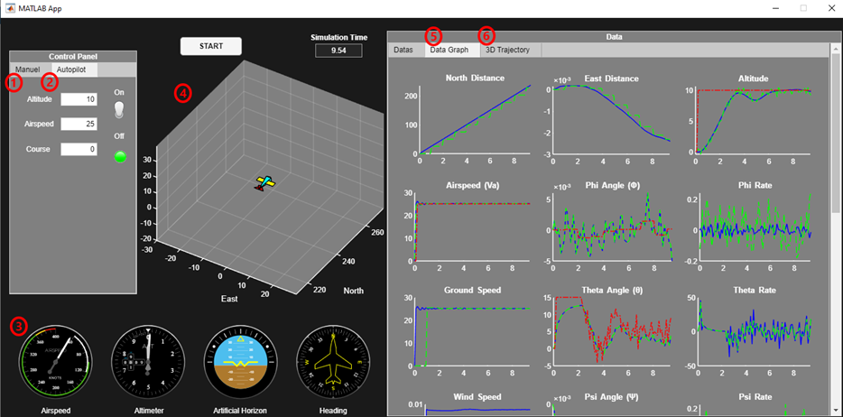
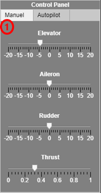
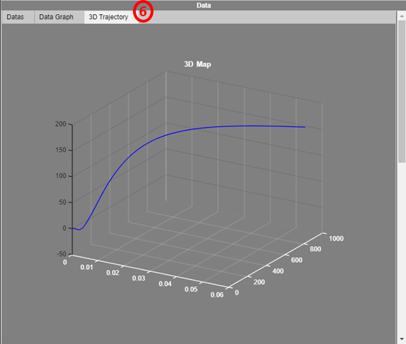
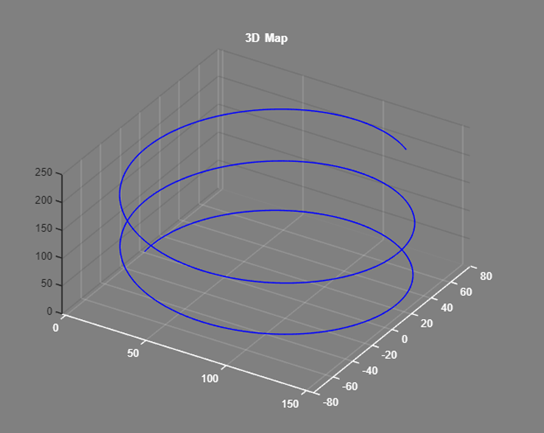
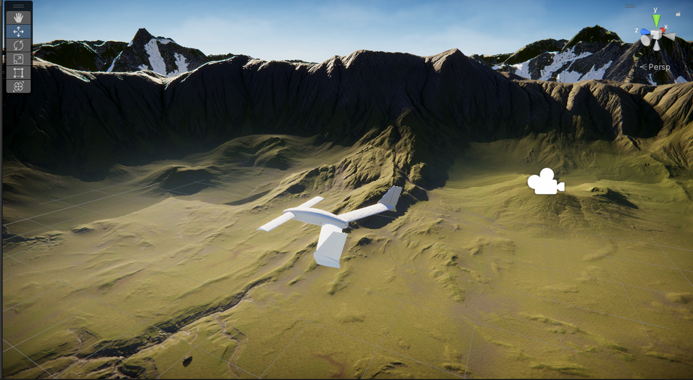

# 6-DOF UAV Flight Simulator & Autopilot Design

Bu proje, **Randal W. Beard ve Timothy W. McLain** tarafından yazılan *"Small Unmanned Aircraft: Theory and Practice"* kitabı referans alınarak geliştirilmiş, 6 serbestlik dereceli (6-DOF) kapsamlı bir İHA simülatörüdür.

Kitabın 12. bölümüne kadar olan tüm teorik altyapı (dinamik modelleme, sensörler, otopilot, durum tahmini ve güdüm) **MATLAB** ortamında kodlanmış, uçuş görselleştirmesi ve manuel kontrol arayüzü ise **Unity 3D** oyun motoru ile çift yönlü **UDP haberleşmesi** üzerinden sağlanmıştır.

## 🚀 Özellikler

Proje, temel uçuş dinamiklerinden otonom görev icrasına kadar aşağıdaki alt sistemleri içerir:

### 1. Matematiksel Modelleme ve Dinamik
* Ses altı hızlarda uçan sabit kanatlı bir İHA'nın **doğrusal olmayan (non-linear)** matematiksel modelinin oluşturulması.
* Aerodinamik katsayıların ve **Trim (Denge)** koşullarının hesaplanması.
* Atmosferik etkiler için **Dryden Rüzgar Modeli** entegrasyonu.

### 2. Otopilot ve Kontrol (PID)
Düşük seviyeli kontrol döngüleri ile uçuş kararlılığı sağlanmıştır:
* **Yanal Kontrol (Lateral):** Roll (Yuvarlanma) açısı ve Course (Rota) açısı kontrolü.
* **Boylamasına Kontrol (Longitudinal):** Pitch (Yunuslama) açısı, İrtifa (Altitude) ve Hava Hızı (Airspeed) kontrolü.
* Gaz (Throttle) ve kontrol yüzeyleri (Elevator, Aileron, Rudder) yönetimi.

### 3. Sensör Modelleme ve Durum Tahmini (State Estimation)
Gerçekçi sensör verileri üretmek için gürültü (Gaussian noise) ve bias modelleri eklenmiştir:
* **Sensörler:** İvmeölçer, Jiroskop, Basınç Sensörü (Barometre), GPS.
* **Filtreleme:**
    * Açısal hız, irtifa ve hava hızı ölçümleri için **Low Pass Filter**.
    * Oryantasyon (Attitude) ve Pozisyon kestirimi için **Extended Kalman Filter (EKF)**.

### 4. Güdüm (Guidance) ve Seyrüsefer
* Belirlenen koordinatlara (Waypoints) sırasıyla gitmeyi sağlayan güdüm algoritması.
* Bu algoritma hem **MATLAB** hem de **C** dilinde implemente edilmiştir.
    * *(Not: C tabanlı güdüm algoritması, Baykar staj döneminde JSBSim modeline entegre edilerek F-16 üzerinde test edilmiştir.)*

### 5. Görselleştirme ve Arayüz (HIL/SIL Konsepti)
* **MATLAB App Designer:** Uçuş parametrelerinin (PID katsayıları, rüzgar şiddeti vb.) ayarlandığı ve anlık verilerin (grafikler, 3D yörünge) izlendiği GUI.
* **Unity 3D Entegrasyonu:** Gerçekçi fiziksel ortam görselleştirmesi.
    * **UDP Haberleşmesi:** Unity'den Joystick verileri (Manuel kontrol) MATLAB'a gönderilir; MATLAB'dan hesaplanan konum/oryantasyon verileri Unity'ye gönderilir.

---
## 📸 Ekran Görüntüleri

### MATLAB Kontrol Arayüzü (GUI)
Kullanıcı arayüzü, simülasyonun tam kontrolünü sağlamak için 6 ana bölüme ayrılmıştır:

 

1.  **Manuel Kontrol Paneli:** Kontrol girdilerinin (elevator, aileron, rudder açısal deformasyonları ve % itki) manuel olarak girildiği bölümdür.
2.  **Otopilot Paneli:** Otopilotun aktif edildiği ve referans değerlerin (hedef irtifa, hava hızı, course açısı) girildiği bölümdür. Sistem, bu referanslara ulaşmak için gerekli kontrol yüzeyi hareketlerini otomatik hesaplar.
3.  **Uçuş Göstergeleri:** Uçuş verilerinin (hız, irtifa, yapay ufuk vb.) anlık takibi için kullanılan analog göstergeler.
4.  **Anlık Oryantasyon:** İHA'nın koordinat düzlemindeki anlık duruşunu (attitude) gösteren 3D görselleştirme.
5.  **Veri Grafikleri:** Simülasyon boyunca tüm verilerin zaman ekseninde çizildiği analiz bölümü. Her veri türü için üç farklı sinyal gösterilir:
    * *Gerçek Değer*
    * *Filtrelenmiş Sensör Değeri*
    * *Hedef Referans Değeri*
6.  **3D Yörünge:** İHA'nın yerel koordinat düzleminde (NED frame) 3 eksendeki hareket izini ve yörüngesini gösteren grafik.

### Performans Grafikleri (Örnekler)
*Yörünge takibi performansı.*

### Unity 3D Görselleştirme
*MATLAB'dan gelen verilerle beslenen İHA'nın 3 boyutlu görselleştirmesi.*

